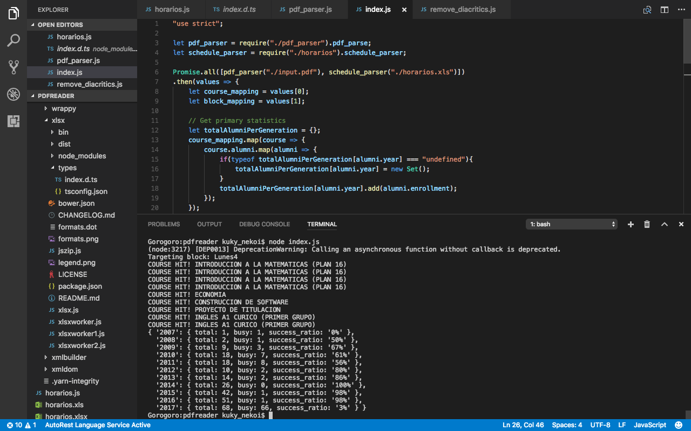

# Gorogoro Engine
*If you ever watched Aldnoah;Zero, you'll get the reference*

This is a Node.js app meant to gain insight about how successful an event organized by the student council can be, based on the data of course scheduling and courses taken.

## Motivation
We, the CAAICC (Centro de Alumnos de Ingenería Civil en Computación / The CS student council) have a common problem (specially for me, the PR guy): When to plan activities for our students.

As this can not sound as a real problem, it is when you're studing on a small campus far from the city. So if you want to make some "events" in benefit of the student comunity, you need to do it in an hour that most people can.

Also, we have some **target audiences** for instance, a version control talk is not as useful for older students but it is for newer ones. Same happens with technical talks and corporate visits.

## Background
N/A

## Examples

## Notes
* I would love to add some test data, but I cannot do so for the meanwhile as it is very sensitive. I'll do so after I finish the first release.

* It's under *active* development. I expect to create a working Electron-based app with kawaii charts, options and stats. For now, only a JSON is displayed.
